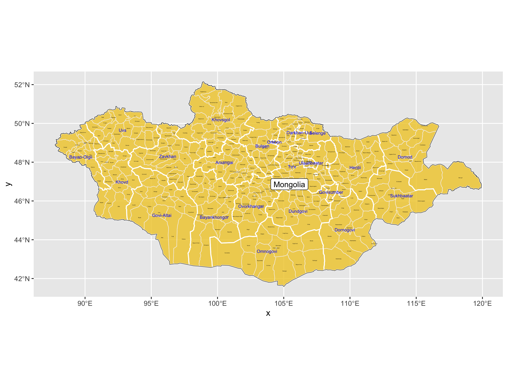
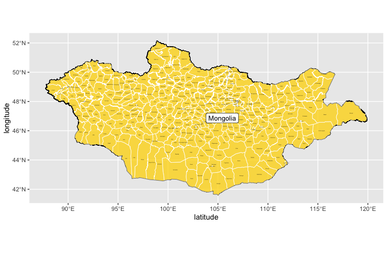
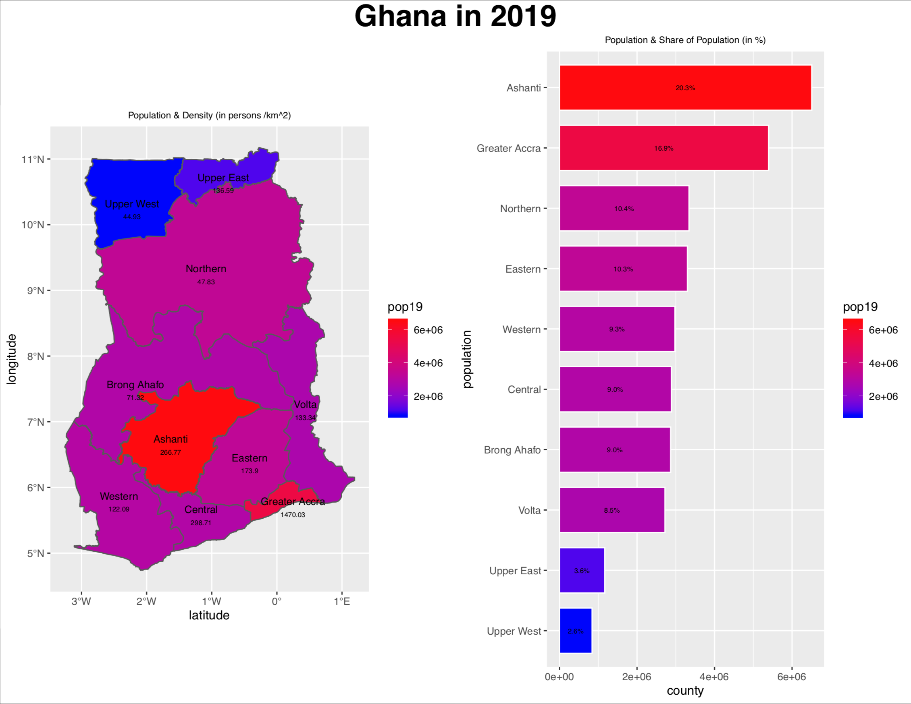
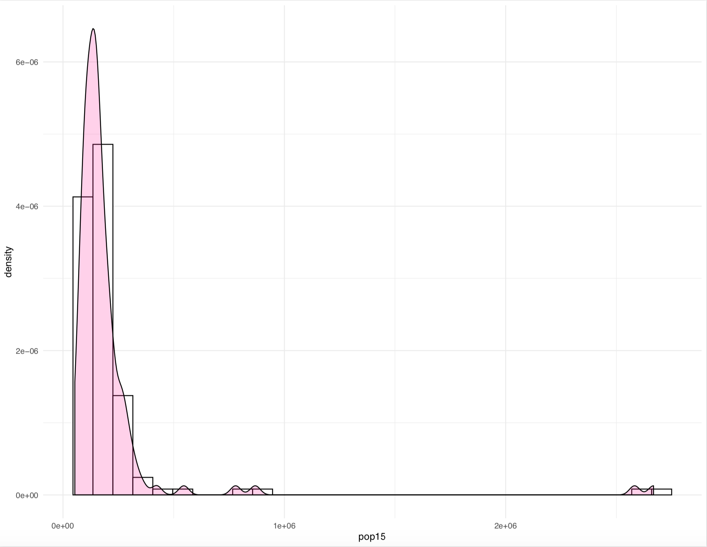

# Ghana

Wicked Problems S1 2019 final

## Administrative Subdivisions of Mongolia

This plot demonstrates the national (adm0), provincial (adm1), and district (adm2) boundaries of Mongolia. Names of each province, or aimags, are in blue, with districts subdivided within each state as demonstrated by the thin, white lines. Mongolia has 21 aimags and 331 districts. 

As you can see from the plot describing just the districts, Mongolia's administrative boundaries are very conplex and contain a lot of data. These large numbers ultimately made it difficult to continue on with Mongolia as my LMIC for the rest of the semester as it took a long time and a lot of computational power to process all data. Therefore, for the rest of the semester, I focused on Ghana. With fewer provinces/districts, this switch simplified and quickened the processing of data. 

## Population of Ghana's regions

The above plot and chart demonstrate the population density in Ghana within its regional boundaries. The highest densities are within the Ashanti region and Greater Accra -- the historical/cultural center and modern trading hub. In general, there is a higher density towards the southern part of the country as this is where Ghana borders the ocean. In the north lies the Saharah desert, a less habitable and more formidable climate to live in. 

