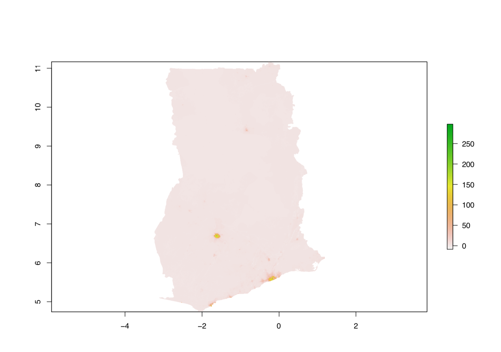
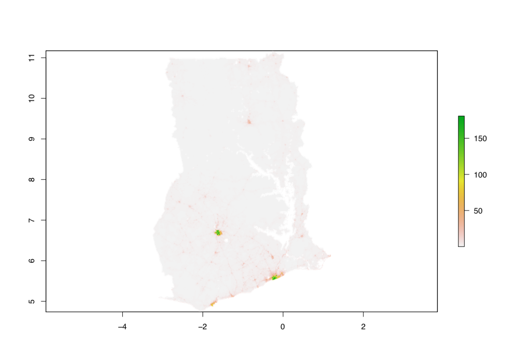
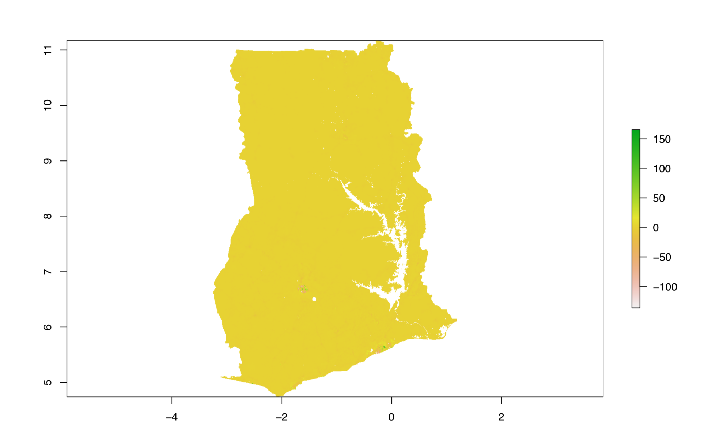
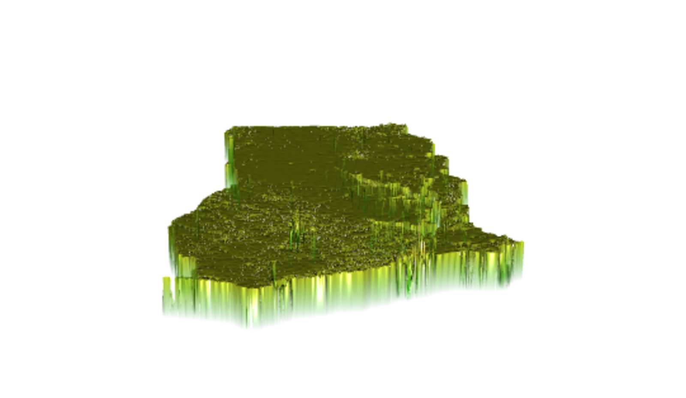
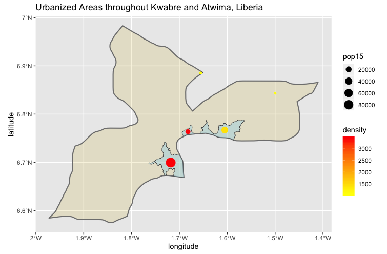
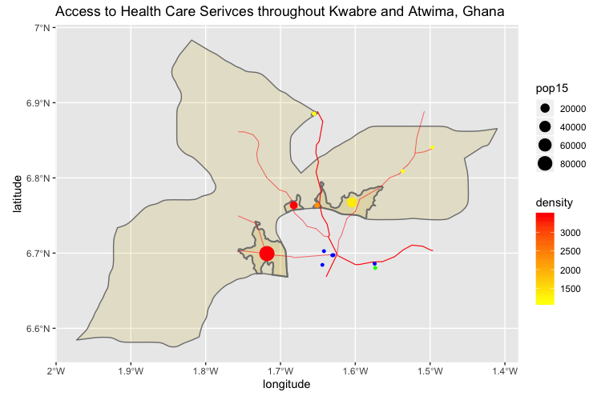
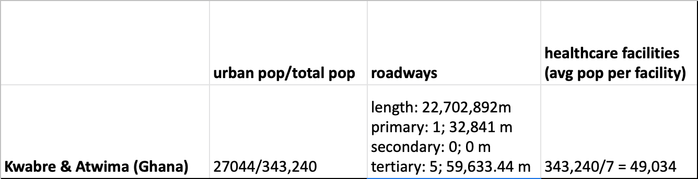
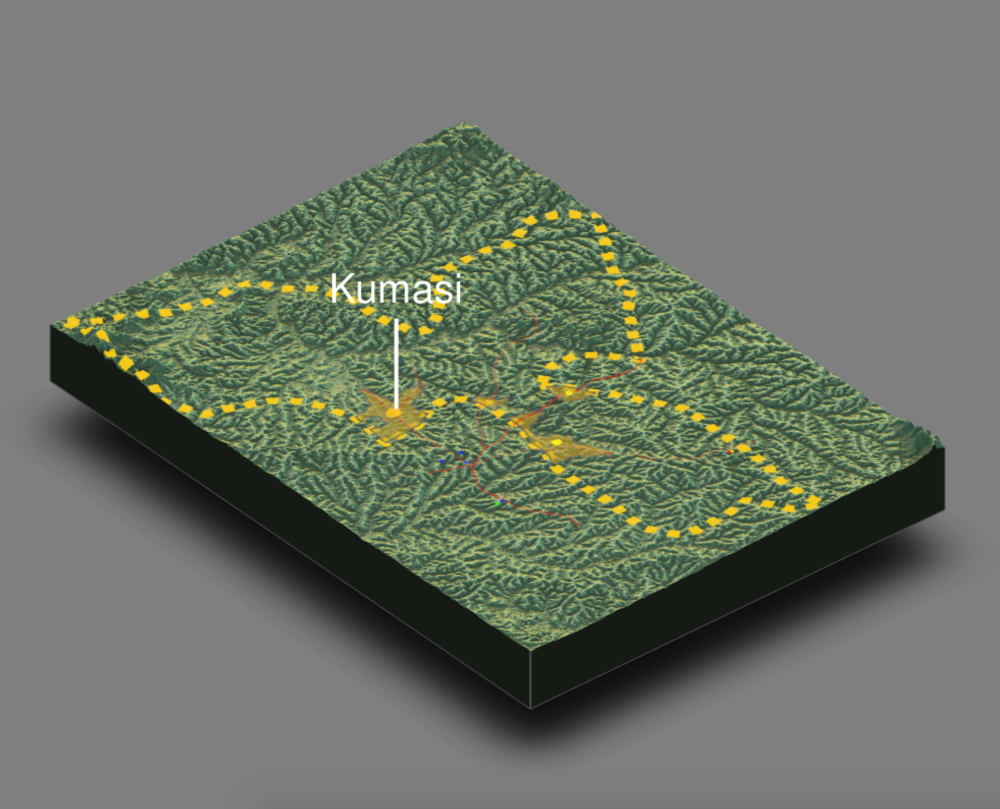

# Ghana

Wicked Problems S1 2019 final

## Administrative Subdivisions of Mongolia

This plot demonstrates the national (adm0), provincial (adm1), and district (adm2) boundaries of Mongolia. Names of each province, or aimags, are in blue, with districts subdivided within each state as demonstrated by the thin, white lines. Mongolia has 21 aimags and 331 districts. 

As you can see from the plot describing just the districts, Mongolia's administrative boundaries are very conplex and contain a lot of data. These large numbers ultimately made it difficult to continue on with Mongolia as my LMIC for the rest of the semester as it took a long time and a lot of computational power to process all data. Therefore, for the rest of the semester, I focused on Ghana. With fewer provinces/districts, this switch simplified and quickened the processing of data. 

## Population of Ghana's regions

The above plot and chart demonstrate the population density in Ghana within its regional boundaries. Much smaller than Mongolia, Ghana has only 10 regions, their eqivalent to Mongolias aimags. The highest densities are within the Ashanti region and Greater Accra -- the historical/cultural center and modern trading hub. In general, there is a higher density towards the southern part of the country as this is where Ghana borders the ocean. In the north lies the Saharah desert, a less habitable and more formidable climate to live in. 

The histogram above describes the most common population numbers in Ghana. This histogram helps confirm what is shown in the plot and chart above, as very few areas are very densily populated, instead, most are faily lowly populated. The two bars to the very right are clearly the Greater Accra and Shanti regions, while the majority of population numbers are much lower.

## Ghana population means

Below are four plots describing:
1. My predicted mean population of Ghana 
2. The 2015 predicted mean population of Ghana
3. The difference between my predicted results of the mean population and 2015 estimates
4. A 3D model of plot 2

Note: Though for most the most accurate plots are the one that have the log of population as the response variable and mean of covariates as predictors, for Ghana, the plots with the least error are the plots whose response variable is simply the population and the mean of covariates are the predictors. I know this because the error found by the cellStats() command has significantly less error for the population found by mean (13708950) than the plots demonstrating population by sum (16805209) and log of population by mean (16351012).

This plot begins to show urban areas. Most highly populated areas are in the regions which past plots have shown to be highly populated/dense.

Similar to plot #1, urban areas are shown as highly populated, this plot does though, demonstrate the location of important roads, as you can see population spikes in vein-like patterns

The highest amount of controversy between plots 1 and 2 occurs in highly populated areas -- with the majority of the country's population development staying in sync with past predictions. In general compared to my predition plot, the 2015 plot overpredicted populations in city centers and underpredicted populations in the outskirts of cities.

## Ghana human settlements, roadways, and healthcare facilities

This plot demonstrates the population and density of settlements within the two districts Kwabre and Atwima. Both are in the Ashanti region. The first district I plotted is Kwabre (the right-most portion), which has a population of 115,461 and 5 urban areas. The second area, Atwima, has a population of 227,779 with mainly 1 large urban area in the middle right and a small urban area at the top.

Next, I added roadways and healthcare facilities:

The main take-away from this plot is that Kwabre and Atwima seem to surround a large urban center. Since roads lead to the same relative intersection, all clinics (green) and hospitals (blue) are near this intersection, and the urban areas of Kwabre and Atwima are centered around the same location, we can assume there is a big city at this center area and that the urban areas shown on the plot are it's outskirts, the beginning of the transition from city to suburb. Further research showed that this city is Kumasi, the second largest city in the nation.

The most prominent road on my plot is a north-south road, which most likely connects the entire country, as it extends throughout the entire plot. I’m assuming that transportation services generally focus on the center of Kumasi, but that networks like buses and trains also have some lines that branch away from the city so that people from the city outskirts (such as those that live in the urban areas of Kwabre and Atwima) can get to and from the city efficiently. Similar to cities such as Chicago, there is a conplex transportation system within the city, but then each mode of transportation also provides routes taking those to and from the downtown area. 

As for health care facilities, they all reside in the city center as well. There are none in Kwabre or Atwima, therefore people living in those districts must go into the city for care. The majority of the facilities are hospitals, with one clinic on the other side of the city from Kwabre and Atwima. Since Kumasi is very prominent and not a new city, health care there should be efficient, and since all hospitals/clinics are in the hub of the city, accessible to many. Since roadways all lead to the same area, it would not be difficult to get to each health care facility or to transport patients from one to another, as long as you lived in the city and other variables such as traffic, weather, and construction do not get in the way. However, if you do not live in the city, it could be difficult to get to a hospital/clinic. Not only are you not close, but roadways thin out substancially the further from the city you get, and transportation services most likely do too. Therefore, living in the city would provide much easier accessability.
 
 

The above table summarizes specificities of the urban areas, roadways and healthcare facilities. However, it is important to note that the populations do not include the city of Kumasi, and therefore when calculating things such as the average population per healthcare facility (3rd collumn), the resulting number will be much higher. In addition, since there are no health care facilities in Kwabre and Atwima, it cannot be assumed that there are healthcare facilities in other districts which surround Kumasi, this could also increase the population per healthcare facility. 
 

Above is a 3D plot which adds on the variable of topography for the region. This new information shows that the countries cultural hub is in a plateau surrounded by mountains. Therefore, the area in which most people reside is flat, making transportation easier. Since mountains are only shown to be at the very edge of the plot, they are not much of an issue, as it also looks as if they are not highly populated based on the lack of population density on the borders of Kwabre and Atwima. Since the Ashanti region is considered "old Ghana", the land here has been populated by humans for centuries. Therefore, areas most habitable have been inhabited for a long while, and areas more harsh have been left alone -- over the years, people have learned what terrain is more livable than others. The fact that this area is now well established and, as a cultural hub respected, only increases how developed it is. Therefore, the closer you get to Kumasi, the more developed the region is, and the more access to healthcare you have. The city itself is probably very developed as it is a popular tourist destination within the country. The further you get from the city (and consequentially closer to the mountains), the less developed and dense the land is -- there are fewer roads, urban areas, and no healthcare facilities.

